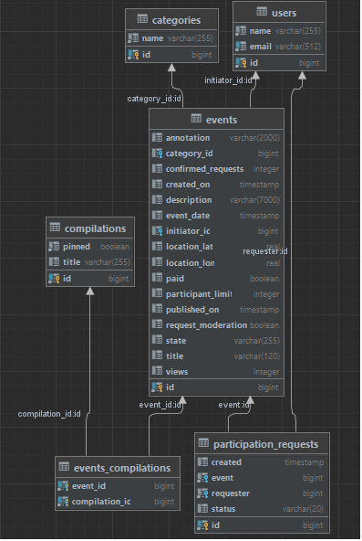
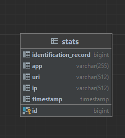

# java-explore-with-me
Приложение для планирования мероприятий. Можно предложить какое-либо событие от выставки до похода в кино и набрать 
компанию для участия в нём  

#### Приложение содержит два сервиса:

#### Основной сервис (ewm-service)  

> Cодержит основную логику приложения. API сервиса состоит из трёх частей:\
    1. Публичное API - содержит логику для работы с приложением, не требующую авторизации.\
    2. Приватное API - содержит логику для работы с авторизованными пользователями.\
    3. API для администратора - содержит логику работы связанную с администрированием

Схема базы данных:

Спецификация: https://raw.githubusercontent.com/yandex-praktikum/java-explore-with-me/main/ewm-main-service-spec.json

#### Сервис статиски (stats-server) 

>Cлужит для сбора информации о количестве обращений пользователей к спискам событий и, 
о количестве запросов к подробной информации о событии. На основе этой информации формирцется статистика о 
работе приложения.

Схема базы данных:

Спецификация: https://raw.githubusercontent.com/yandex-praktikum/java-explore-with-me/main/ewm-stats-service-spec.json 

Запуск приложения осуществляется через докер. Контейнер содержит 4 образа
Порядок запуска:
- stats_db PORTS: 6542:5432
- ewm-db PORTS: 6541:5432
- stats-serve PORTS: 9090:9090
- ewm-service PORTS: 8080:8080

### Ссылка на пул-реквест: https://github.com/AlexOdnoshivkin/java-explore-with-me/pull/1 